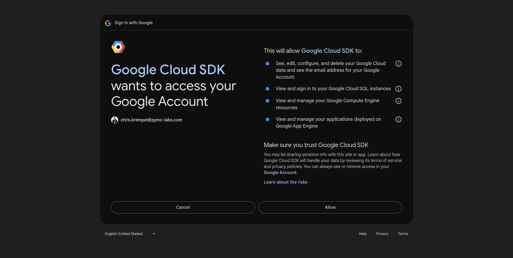

# pyMc server - cli deployment tool

## what does it do

The Tool will be used to deploy on skypilot. It aims to simplify the deployment process. 
In the end, the application needs to merge different .yaml files (pyMc-/user Files) together 
# Quickstart

## Installation

Start a new virtual environment with micromamba (conda/mamba/or similar).

```bash
micromamba create -n pymc-server -c conda-forge python=3.12
micromamba activate pymc-server
```

Install this library from PiPy `pip3 install pymc-server`

If you want to install this library from source:
```bash
git clone https://github.com/pymc-dev/PyMC-Server
cd PyMC-Server

pip3 install . # run `pip3 install -e .` if you want to be able to edit the code
```

### Setting up a cloud: Google Cloud

1. Run `pymcs check` to see if you already have credentials setup. If you see a green checkmark for GCP (Google Cloud Platform), skip to the next section
2. Install the google cloud SDK and authenticate.
  ```bash
  # inside your activated environment
  micromamba install -c conda-forge google-cloud-sdk
  gcloud init

  # Run this if you don't have a credentials file.
  # This will generate ~/.config/gcloud/application_default_credentials.json.
  gcloud auth application-default login
  ```
  > Tip:
  > If you are using multiple GCP projects, list all the projects by gcloud projects list and activate one by gcloud config set project <PROJECT_ID> (see GCP docs).

3. Follow the link to Google and authorize the Google Cloud SDK. This will create and persist credentials on your local computer. Running pymc-server commands via Google Cloud will introduce cost to your Google Cloud bill according to the VMs provisioned by your configuration (see next section).

  

  Follow through the rest of the GCP configuration in your terminal.

4. In Order to let PyMC-Server manage cloud resources for you, you need to grant your Google IAM account the permissions to execute all actions neccessary.

  Go to [Google IAM Console](https://console.cloud.google.com/iam-admin/iam) to access and edit your IAM permissions. 

  Next, create a new role and name it e.g. `pymcs-server-role`.
  
  >Note: we will be granting overly permissive rules for convenience of your setup.
  >For production usage it is strictly neccessary that you review the permissions given. Please refer to [GCP: Minimal Permissions](https://skypilot.readthedocs.io/en/latest/cloud-setup/cloud-permissions/gcp.html#minimal-permissions) for more information on how to setup secure and fine grained permissions.

  Add the following permissions to your newly created role. At the time of writing this document Google offers a search bar where each permission needs to be entered. The table below the search bar will display the roles under this name, and you can select them all together with the first checkbox in the table (header).

```
roles/browser
roles/compute.admin
roles/iam.serviceAccountAdmin
roles/iam.serviceAccountUser
roles/serviceusage.serviceUsageConsumer
roles/storage.admin
roles/iam.securityAdmin
```


  >Note: If you use PyMC-Server as part of an organization, your GCP admin might have setup a role already (e.g. `pymc-server-role `) and you can easily attach your user to it.

### Status of your deployments

To check the status of all your deployments run `pymcs status`. A table is printed to your terminal.

```bash
❯ pymcs status
Clusters
NAME  LAUNCHED      RESOURCES                 STATUS  AUTOSTOP  COMMAND
tc    5 months ago  1x Kubernetes(2CPU--2GB)  UP      -         pymcs launch -c tc hello_sk...

Managed jobs
No in-progress managed jobs. (See: pymcs jobs -h)

Services
No live services. (See: pymcs serve -h)
```
